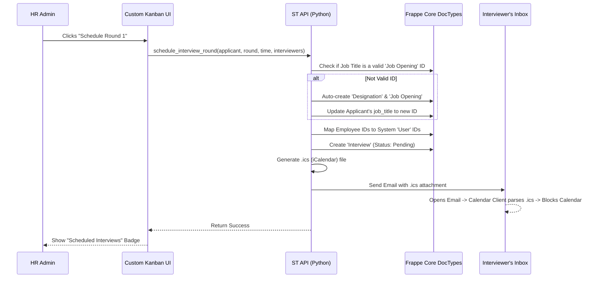
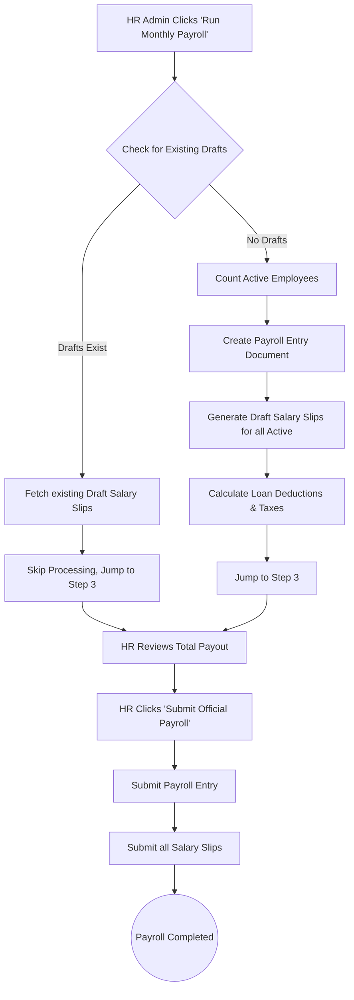

# Standard Touch (ST) Automation - System Documentation & Flows

This is a living document that tracks all custom functionalities, automated workflows, and system architectures added to the `st_automation` Frappe app. 

*It must be updated whenever a new major workflow or feature is introduced.*

---

## 1. Core Functionalities Added

### 👨‍💼 Recruitment & Applicant Tracking
*   **Visual Kanban Pipeline:** A drag-and-drop Kanban board for managing candidates across stages (Applied, Shortlisted, Replied, Rejected).
*   **Quick Add Candidate:** A global modal to instantly parse and add a candidate to the pipeline without navigating to the standard Frappe form.
*   **3-Round Interview Wizard:** A streamlined scheduling interface directly inside the candidate's profile.
    *   **Round 1:** Initial Screening (Multi-select interviewers).
    *   **Round 2:** Technical Round (Default: Hamza Ali).
    *   **Round 3:** Managerial Round (Default: Abdul Manan).
*   **Auto-Job Opening Resolution:** Bypasses strict Frappe standard validations by auto-creating and linking valid `Job Opening` documents in the background if the recruiter types a custom job title.
*   **Calendar Invites & Email Dispatch:** Automatically generates standard `.ics` (iCalendar) payloads and emails them to the assigned interviewers.
*   **Interview History Tracking:** The candidate profile dynamically fetches and displays all previously scheduled interviews, showing the interviewers, dates, and status.

### 💰 Payroll & Finance Automation
*   **1-Click Payroll Run:** Bypasses the complex standard ERPNext Payroll Entry process. It automatically calculates attendance, processes salary slips for all active employees, and factors in loan deductions.
*   **Smart Draft Resumption:** If a payroll run is interrupted or paused at the "Draft" stage, the system intelligently detects the existing drafts for the month and allows HR to resume and "Submit Official Payroll" without throwing duplicate errors.
*   **Self-Healing Accounts:** Automatically detects if the company is missing a default "Payroll Payable Account" and creates/assigns one in the background to prevent the payroll run from crashing.
*   **1-Click Loan Disbursement:** A simplified modal to issue employee loans/advances. Automatically sets critical flags (like `is_term_loan`) and defaults `moratorium_tenure = 0` so the loan correctly docks from their next salary slip.

### 🎨 UI & UX Enhancements
*   **Gen-Z / Modern Aesthetic:** Removed default Frappe gray themes in favor of vibrant Emerald, Indigo, Amber, and Red accents.
*   **Dynamic Sidebar:** Added a custom floating sidebar with role-based access control and a glowing animated "Flame" logo.
*   **Mobile Responsiveness:** Kanban boards snap horizontally on mobile devices, and action buttons scale appropriately to prevent awkward layout clipping.

---

## 2. Workflow Diagrams

### Recruitment & Interview Flow

### 1-Click Payroll Flow

---

## 3. Calendar Integration: How It Works Currently

**Current Implementation (`.ics` Email Attachments):**
The system currently generates an `.ics` file (a universal calendar format used by Google, Apple, and Outlook) and attaches it to an email sent directly to the interviewers. 
*   **Does the interviewer get a mail?** Yes, the system immediately emails the assigned interviewers.
*   **Does it block their calendar?** Yes, as soon as they open the email in Gmail, Outlook, or Apple Mail, their email client automatically detects the `.ics` file and prompts them to "Add to Calendar". Once they click yes, that time slot is blocked on their personal calendar.

**Why `.ics` instead of Direct Google API Sync?**
Directly syncing with Google Calendar without user interaction requires setting up **Google OAuth 2.0**. This involves:
1. Creating a project in the Google Cloud Console.
2. Generating a Client ID and Client Secret.
3. Configuring Frappe's "Google Settings" integration.
4. Having each interviewer authenticate their Google account inside ERPNext.

*Using `.ics` attachments achieves 95% of the same result (it blocks their calendar and notifies them) with 0% of the complex Google Cloud setup.* If direct API syncing is absolutely required in the future, the Google OAuth integration will need to be configured on the server.
