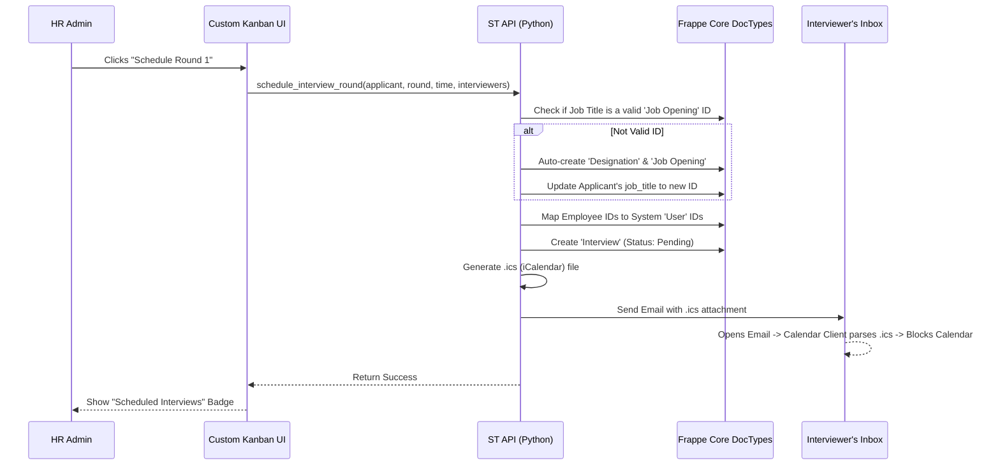
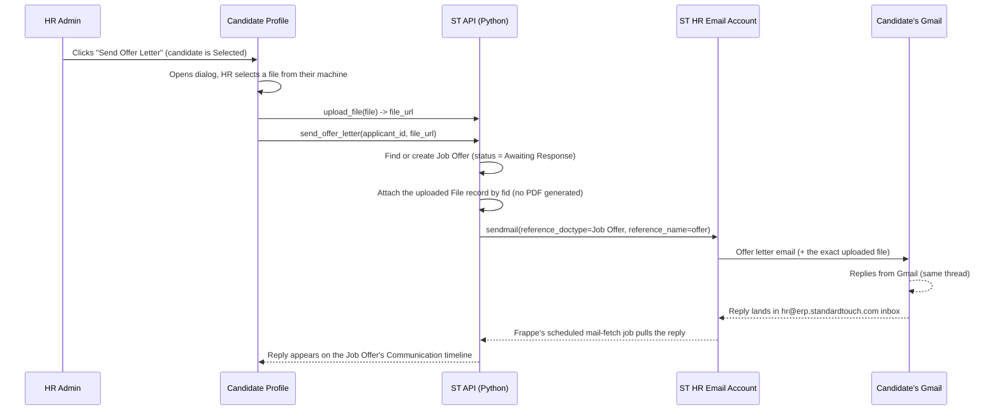
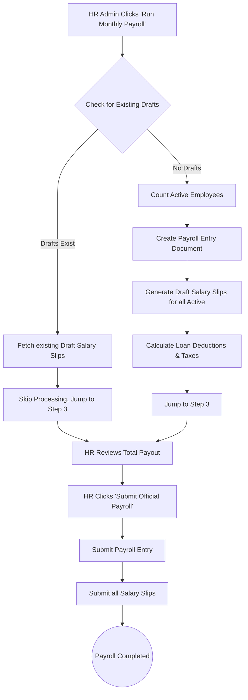

# Standard Touch (ST) Automation - System Documentation & Flows

This is a living document that tracks all custom functionalities, automated workflows, and system architectures added to the `st_automation` Frappe app. 

*It must be updated whenever a new major workflow or feature is introduced.*

---

## 1. Core Functionalities Added

### 👨‍💼 Recruitment & Applicant Tracking
*   **Visual Kanban Pipeline:** A drag-and-drop Kanban board for managing candidates across stages (Applied, Shortlisted, Replied, Rejected).
*   **Quick Add Candidate:** A global modal to instantly parse and add a candidate to the pipeline without navigating to the standard Frappe form.
*   **3-Round Interview Wizard:** A streamlined scheduling interface directly inside the candidate's profile.
    *   **Round 1:** Initial Screening (Multi-select interviewers).
    *   **Round 2:** Technical Round (Default: Hamza Ali).
    *   **Round 3:** Managerial Round (Default: Abdul Manan).
*   **Auto-Job Opening Resolution:** Bypasses strict Frappe standard validations by auto-creating and linking valid `Job Opening` documents in the background if the recruiter types a custom job title.
*   **Calendar Invites & Email Dispatch:** Automatically generates standard `.ics` (iCalendar) payloads and emails them to the assigned interviewers.
*   **Interview History Tracking:** The candidate profile dynamically fetches and displays all previously scheduled interviews, showing the interviewers, dates, and status.
*   **Offer Letter Send + Gmail Reply Sync:** Once a candidate is Selected (after the final interview round), HR can send their actual offer letter (a PDF where print-format rendering is available) directly from the candidate's profile. Replies the candidate sends from Gmail thread back onto that Job Offer's timeline in ERPNext automatically — this is standard Frappe email threading against the already-configured "ST HR" Email Account, not custom sync code. See the dedicated section below.

### 💰 Payroll & Finance Automation
*   **1-Click Payroll Run:** Bypasses the complex standard ERPNext Payroll Entry process. It automatically calculates attendance, processes salary slips for all active employees, and factors in loan deductions.
*   **Smart Draft Resumption:** If a payroll run is interrupted or paused at the "Draft" stage, the system intelligently detects the existing drafts for the month and allows HR to resume and "Submit Official Payroll" without throwing duplicate errors.
*   **Self-Healing Accounts:** Automatically detects if the company is missing a default "Payroll Payable Account" and creates/assigns one in the background to prevent the payroll run from crashing.
*   **1-Click Loan Disbursement:** A simplified modal to issue employee loans/advances. Automatically sets critical flags (like `is_term_loan`) and defaults `moratorium_tenure = 0` so the loan correctly docks from their next salary slip.

### 🎨 UI & UX Enhancements
*   **Gen-Z / Modern Aesthetic:** Removed default Frappe gray themes in favor of vibrant Emerald, Indigo, Amber, and Red accents.
*   **Dynamic Sidebar:** Added a custom floating sidebar with role-based access control and a glowing animated "Flame" logo.
*   **Mobile Responsiveness:** Kanban boards snap horizontally on mobile devices, and action buttons scale appropriately to prevent awkward layout clipping.

---

## 2. Workflow Diagrams

### Recruitment & Interview Flow



### Talent Pool / Bench Follow-Up Flow

**Problem this closes:** the "Bench" hiring decision was previously a dead
end — the candidate's status changed to `Hold`, but no email was sent to
them (unlike Select and Reject, which both message the candidate), and
there was no UI action anywhere to bring them back into the pipeline. They
just sat there permanently.

**What was added:**
* Moving a candidate to **Talent Pool / Bench** now also sends them a
  polite "we're keeping you in mind for future roles" email, mirroring the
  existing Select (Job Offer) and Reject (rejection email) notification
  pattern.
* A new **Reconsider for New Role** action (in the candidate detail modal,
  and hinted on the Kanban card) moves a benched candidate back into the
  active pipeline (`status = "Replied"`, clearing `talent_pool_tag` — the
  same "Replied" stage used for the original hiring decision), where HR can
  make a fresh Select / Bench / Reject call — for the same role or a newly
  relevant one.
* **Reject** is also now available directly from the bench, for candidates
  who should be formally closed out instead of left benched indefinitely.

Both `Job Applicant.status` and `.talent_pool_tag` are constrained Select
fields with a small fixed set of valid values (`status`: Open/Replied/
Rejected/Hold/Accepted; `talent_pool_tag`: blank/Shortlisted/On Bench/
Future Pipeline/Rejected) — confirmed directly via `frappe.get_meta`. An
earlier version of this fix used `status = "Interview Completed"`, which
isn't a valid option and threw a real validation error on click; fixed to
`"Replied"`, matching what `submit_interview_feedback` already uses for the
same kind of transition.

```mermaid
flowchart TD
    A[HR clicks Bench on a candidate] --> B[status = Hold, talent_pool_tag = On Bench]
    B --> C[Polite "keeping you in mind" email sent to candidate]
    C --> D[Candidate sits in Talent Pool / Bench column]
    D --> E{HR revisits candidate}
    E -->|Reconsider for New Role| F[status = Replied, talent_pool_tag cleared]
    F --> G[Candidate reappears in Replied column]
    G --> H[Fresh Select / Bench / Reject decision]
    E -->|Reject| I[status = Rejected, rejection email sent]
```

Backend: `record_decision()` in `st_automation/api/recruitment.py` — the
`Bench` branch now sends the email, and a new `Reconsider` branch handles
the status transition back into the active pipeline. Frontend:
`ApplicantDetailModal.jsx` (the `applicant.stage === 'Hold'` action block)
and `KanbanBoard.jsx` (the "Reconsider →" hint on Hold-column cards).

### Offer Letter Send + Gmail Reply Sync

**A real, previously-silent bug this closes:** the Select decision's "draft
Job Offer" step had never actually worked — `frappe.db.count("Job Offer")`
was **0** despite 6 candidates already marked Selected/Hired. Two bugs,
both silently swallowed by a bare `except`/`log_error`: `status = "Draft"`
isn't a valid Job Offer status (only "Awaiting Response"/"Accepted"/
"Rejected" are — confirmed via `frappe.get_meta`), and setting `designation`
to a raw free-text job title threw "Could not find Designation: X" whenever
it didn't exactly match an existing Designation record.

**What was added, once that was fixed:**
* After the final interview round, once a candidate is Selected, HR clicks
  **Send Offer Letter** on their profile, which opens a small dialog to
  **upload the actual offer letter file from their own machine** — nothing
  is auto-generated. An earlier version of this feature auto-rendered a PDF
  from the Job Offer print format instead; the user asked for that to be
  replaced with a real upload, since HR needs to send the specific letter
  they prepared, not a system-generated stand-in. The uploaded file is what
  gets attached to the email, exactly as provided.
* The email is sent with `reference_doctype="Job Offer"` /
  `reference_name=<offer>` — **standard Frappe email threading, not custom
  sync code.** The "ST HR" Email Account (`hr@erp.standardtouch.com`)
  already has both incoming and outgoing enabled on this site. When the
  candidate hits Reply in Gmail, Frappe's own scheduled mail-fetch job picks
  up the reply and threads it onto that Job Offer's Communication timeline
  automatically. No new email credentials or IMAP setup were needed —
  this was just never wired up with the right reference fields before.
* A shared `_resolve_designation()` helper (auto-creates the Designation if
  it doesn't exist yet) and `_get_default_company()` helper now back **all
  three** places that create a Job Offer or Employee record, so this
  exact bug class can't silently reappear in one spot while looking fixed
  in another.



Backend: `send_offer_letter(applicant_id, file_url)`, `_resolve_designation()`,
and `_get_default_company()` in `st_automation/api/recruitment.py` — requires
`file_url` now, errors if not provided. Frontend: `uploadFile()` in
`api/client.js` (wraps Frappe's standard `/api/method/upload_file`), and the
offer-letter upload dialog in `ApplicantDetailModal.jsx` (state:
`isOfferLetterOpen`/`offerLetterFile`/`isSendingOffer`), replacing what was a
single "Send Offer Letter" button with no confirmation step.

### App-wide contrast fix: dark-mode color pairs inside a light-themed app

**Root cause of several "text is unreadable" reports.** Many components
used a `bg-*-950/NN` (near-black background at low opacity) + `text-*-300`/
`text-*-400` (light text) color pair — correct for a *dark-themed* UI, but
this app is light-themed throughout. The pairing rendered as low-contrast
light-on-light text wherever it appeared. This wasn't one isolated mistake —
it was systemic, likely copied forward from an early dark-theme draft and
never adapted. Found and fixed in: the shared `Badge` component (every
non-default variant — this alone affected every status badge across the
whole app), the shared `Toast` component (every success/error/warning
notification, app-wide), `StatCard` (every dashboard stat tile), the Loan
Application Wizard (Monthly EMI card, Zero-Moratorium banner), Diagnostics
view, Payroll Dashboard (hero banner + quick-action icon chips), Run Payroll
Wizard (report table amounts, summary banner), Job Openings (publish-status
pill), Candidate Slot Booking (public-facing error/success cards), and
Salary Slips view (amount columns). All converted to the same light-surface
pattern already used correctly elsewhere in the app
(e.g. `bg-emerald-50 border-emerald-200 text-emerald-700`). If a future
component reintroduces a `bg-*-950`/`text-*-300` pair, that's the same bug
again — check whether the surrounding page is actually dark before assuming
a "dark accent" pattern is correct here.

### Onboarding: "Onboard as Employee" no longer shows once already done

`get_pipeline()` now includes a batched Employee-by-email lookup
(`app["employee"]`) instead of the frontend unconditionally showing the
button every time — clicking it after an Employee already existed just
threw "Employee EMP-XXXXXX already exists with this email" instead of the
button simply not being offered. `ApplicantDetailModal.jsx` now renders a
plain "Onboarded as {employee}" badge instead of the button when
`applicant.employee` is set.

### Loans & Advances now shows actual disbursed loans

`ActiveLoansView.jsx` previously never queried loan data at all — it showed
a static "get started" card permanently, even with real disbursed loans
already in the system (confirmed via `bench execute`: 6 real "Disbursed"
Loan records existed while this page showed an empty state). Added
`get_active_loans()` in `payroll.py`, wired into the same `loadPayroll()`
refresh cycle already used for the payroll summary and salary slips (so it
also refreshes right after a new loan is disbursed), and the view now
renders an actual table (employee, amount, EMI, tenure, disbursed date,
status) when loans exist, falling back to the original empty-state card
only when there truly are none yet.

### Build output now uses content-hashed filenames (was a recurring source of "the fix isn't showing up" confusion)

`vite.config.js` previously emitted fixed filenames (`index.js`/`index.css`)
on every build — the URL never changed on deploy, so the browser (Safari
especially) could keep serving an old cached bundle after a fix shipped.
This caused at least two real rounds of confusion this session where a
genuinely-fixed feature looked "still broken" until a manual hard refresh.
Switched to Vite's default content-hashed output
(`index-<hash>.js`/`index-<hash>.css`). Since `www/hr-ops.html` hardcoded
the old fixed paths, `www/hr-ops.py` now resolves whichever hashed filename
is actually on disk (`_find_built_asset()`) and passes it to the template
as `js_file`/`css_file`, so the served page always references the exact
files from the most recent build.

### Sidebar brand icon changed

The sidebar's brand mark was a flame icon (`lucide-react`'s `Flame`),
unrelated to HR. Replaced with `Users2` (a people icon) per a supplied
reference image emphasizing a people/HR visual — kept in the same
red-gradient badge treatment already established, rather than trying to
reproduce a busy multi-icon illustration at small icon size.

### 1-Click Payroll Flow



---

## 3. Calendar Integration: How It Works Currently

**Current Implementation (`.ics` Email Attachments):**
The system currently generates an `.ics` file (a universal calendar format used by Google, Apple, and Outlook) and attaches it to an email sent directly to the interviewers. 
*   **Does the interviewer get a mail?** Yes, the system immediately emails the assigned interviewers.
*   **Does it block their calendar?** Yes, as soon as they open the email in Gmail, Outlook, or Apple Mail, their email client automatically detects the `.ics` file and prompts them to "Add to Calendar". Once they click yes, that time slot is blocked on their personal calendar.

**Why `.ics` instead of Direct Google API Sync?**
Directly syncing with Google Calendar without user interaction requires setting up **Google OAuth 2.0**. This involves:
1. Creating a project in the Google Cloud Console.
2. Generating a Client ID and Client Secret.
3. Configuring Frappe's "Google Settings" integration.
4. Having each interviewer authenticate their Google account inside ERPNext.

*Using `.ics` attachments achieves 95% of the same result (it blocks their calendar and notifies them) with 0% of the complex Google Cloud setup.* If direct API syncing is absolutely required in the future, the Google OAuth integration will need to be configured on the server.

## 4. Critical fixes: blank page, and the company filter doing nothing

### The whole app went blank — a genuine root-cause bug, not a build issue

After switching to content-hashed build filenames (see above), the app
loaded to a **completely blank white page**. Root cause: Frappe's website
renderer resolves a template's Python controller by replacing hyphens with
underscores — for `hr-ops.html` it looks for **`hr_ops.py`**, never
`hr-ops.py`. The controller file had been named `hr-ops.py` (matching the
`.html` file's hyphen) since it was first created, so `get_context()` had
**never actually been invoked, ever** — harmless before, since nothing in
the template depended on custom context data (`window.ST_BOOT` is built
from `frappe.session.*` globals directly in the template, not from
`context.boot`). It only became fatal once the template started requiring
`{{ js_file }}`/`{{ css_file }}` from that (non-functional) controller —
those rendered as the literal, unresolved string `{{ js_file }}`, an invalid
asset URL, so the JS bundle never loaded and nothing could mount. Fixed by
renaming the file to `www/hr_ops.py`. Confirmed via direct `curl` against
the live site (not just a code read) that the template now resolves to the
real, currently-built filenames and that those exact URLs return `200`.

### Company selector never actually filtered anything

The topbar's company dropdown correctly updated its own React state, but
`recruitmentApi.getJobOpenings()` and `.getPipeline()` were never called
with that company at all — so switching companies changed nothing for Job
Openings or the Candidate Pipeline (it did already work for the Payroll
tab, which was correctly wired). `Job Applicant` has no `company` field of
its own — a candidate's company is implied by which `Job Opening` they
applied to — so the fix resolves the selected company to its Job Openings
first, then filters applicants by `job_title` being one of those. Verified
directly against live data: filtering by "StandardTouch" now correctly
returns exactly its 3 job openings / 3 applicants, other companies with no
openings correctly return empty, and the unfiltered view still shows all 8
applicants across every company.

### Salary Structure Assignment was silently creating ₹0.00 payroll for everyone

**Root cause of the earlier "All salary slips are ₹0.00 — Submission is
blocked" warning, now confirmed and fixed.** The "Assign Salary Structure"
form never had a Base Salary field at all — `assign_salary_structure()`
created every `Salary Structure Assignment` without setting `base`, which
defaults to 0. Confirmed directly by querying every existing assignment on
this site: **all of them have `base = 0.0`**. Since this system's salary
components compute their formulas off Base, every employee assigned a
structure through this form was destined to always get a ₹0.00 payslip,
with no indication why until payroll actually ran.

Fixed: added a required "Base Salary (Monthly)" input to
`AssignSalaryStructureModal.jsx`, and `assign_salary_structure()` now
requires `base > 0` and rejects the request otherwise (checked in the
backend too, not just the frontend `required` attribute — confirmed via
direct call that both a missing and a zero base are rejected with a clear
error rather than silently creating another broken assignment).

**Not done automatically, flagged instead:** the ~10 pre-existing
assignments with `base = 0.0` were not retroactively edited — that's a
real data change affecting other employees' payroll and wasn't asked for.
Any employee already assigned a structure before this fix will still need
to be reassigned (or have their assignment's Base corrected directly) to
actually get paid correctly on the next payroll run.

### Salary Structure dropdown's icon was overlapping its own text

The `Building2` icon absolutely positioned over the "Salary Structure"
`<select>` overlapped the selected option's text (visible with a
short value like "test") — the icon and the select's own text were
competing for the same horizontal space. Fixed properly rather than just
nudging padding by a few pixels: added `appearance-none` to the `<select>`
(removes the browser's own native rendering quirks around this, which
padding-only fixes don't reliably control across browsers) with a matching
manually-drawn `ChevronDown` on the right (since `appearance-none` also
removes the native dropdown arrow), and `pointer-events-none` on both icons
so they never intercept clicks meant for the select underneath.

## 5. Text size and mobile responsiveness

### App-wide text was too small

Nearly every screen used `text-xs` (or smaller arbitrary sizes like
`text-[10px]`/`text-[11px]`) for body text, tabs, inputs, table cells, and
card content — not just the sidebar. Bumped consistently across 21 files
(including the shared `Button` and `Badge` components, so anything reusing
them benefits automatically): `text-xs`→`text-sm`, `text-[11px]`→
`text-[13px]`, `text-[10px]`→`text-[12px]`. Sidebar nav specifically also
got larger icons (`h-4`→`h-5`) and taller touch targets (`py-2.5`→`py-3`)
for mobile.

### Topbar overflow was dragging the whole page into horizontal scroll

A direct side effect of the text-size increase above: `TopHeader.jsx`'s
action-button row (`justify-between`, no wrap) no longer fit at narrow
mobile widths once its buttons' text got larger, and since nothing
constrained horizontal overflow at the page root, the *entire page*
became horizontally scrollable instead of just that one row overflowing
locally. Fixed two ways: the "Add Candidate"/"Quick Incentive" buttons
collapse to icon-only below the `sm` breakpoint (label available via
`title` instead), and `App.jsx`'s root container now has
`overflow-x-hidden` as a standing defensive backstop — so a future overflow
anywhere clips locally instead of dragging the whole page sideways again.

## 6. Known gaps and a critical infrastructure finding (not caused by any change above)

### Outbound/inbound email is completely broken site-wide — pre-existing, not something this session's changes caused

**This directly affects Send Offer Letter, the Bench notification email,
Reject notification email, and the pre-existing interview `.ics` calendar
invites — none of these are actually reaching anyone right now.** Found
while investigating "what else is missing": the `Error Log` shows both
Email Accounts ("ST HR" and "ERP Support") failing on **every** scheduled
sync attempt with `Failed to decrypt key Email Account.*.password —
Encryption key is invalid!` — the classic symptom of a site restored/copied
from a backup without carrying over its matching encryption key from
`site_config.json`. Confirmed the real-world impact directly: **every**
`Email Queue` entry, going back to well before this session started (this
morning), sits at `status: "Not Sent"` — including the two real "Send Offer
Letter" test emails from this session (`HR-OFF-2026-00005`). This is a
pre-existing site/infrastructure problem, not a regression from anything
built this session — but it means the email side of every recruitment
feature has silently never worked, for however long the encryption key has
been mismatched.

**Not something Claude can fix directly** — this needs either the site's
original encryption key restored in `site_config.json` (whoever migrated or
backed up this site would have that), or simpler: re-entering the actual
account password on both "ST HR" and "ERP Support" under Email Account
settings, which re-encrypts it correctly under the site's *current* key.
Either fix is an infrastructure/credentials action for a human to take, not
a code change.

### Other known, not-yet-actioned gaps

* **~10 pre-existing Salary Structure Assignments still have `base = 0.0`**
  (created before the Base Salary field existed in the assign-structure
  form). Not retroactively edited — flagged for whoever owns payroll to
  decide whether those specific employees need reassigning.
* **"Reconsider" (Bench → back into active pipeline) has not been
  re-tested live** since its one bug fix (invalid status value) — the fix
  itself was verified against `frappe.get_meta`, but not re-clicked through
  the actual UI afterward.
* Given the email finding above, **the Gmail-reply-sync half of Send Offer
  Letter cannot currently work at all** — even once outbound sending is
  fixed, incoming mail fetch (the same broken Email Account) needs to
  succeed too for a candidate's reply to ever thread back into ERPNext.
* **Checked whether the encryption key issue could be fixed without asking
  for real credentials** — no local backup of `site_config.json` exists
  (`sites/standardtouch/private/backups` is empty) with the original
  matching key, and `Employee.ctc` (the one plausible source for backfilling
  the `base = 0.0` assignments below) is also 0 for every affected employee.
  Neither can be fixed without the user's own input — flagged rather than
  invented.

## 7. Job Opening creation added — was completely missing

**A real gap, not just missing polish:** the Job Openings page only ever
listed existing openings (with a publish/hide toggle) — there was no way to
create one at all from this app. HR would have had to go into classic
ERPNext Desk for that one specific action, breaking the "everything from
this system" premise the rest of the app follows.

Added `create_job_opening()` in `recruitment.py`: reuses the existing
`_resolve_designation()` helper so a recruiter can type a free-text job
title (e.g. "Digital Marketing Lead") without hitting Job Opening's strict
`designation` Link-field validation — same "don't make HR deal with
ERPNext's strict linking" pattern already used for Select/Offer/Onboard
elsewhere in this file. Frontend: `QuickAddJobOpeningModal.jsx` (Job Title,
Department, Vacancies, Publish-on-portal checkbox), wired to a new "New Job
Opening" button in `JobOpeningsView.jsx`'s header. Verified end-to-end
against the live site (created and cleaned up a real test record) before
counting this as done.

**Other pages audited for the same "no way to create" gap** — Candidate
Pipeline already has "Add Candidate", Loans & Advances already has "New
Loan Application", Payroll's quick-action cards already cover Incentives/
Loans/Payslips. Salary Slips and My Interviews are deliberately not
manually-creatable (slips come from a payroll run, interviews get scheduled
from inside a candidate's profile) — adding a standalone create button
there would let HR create records that bypass the processes those records
are supposed to represent, so left alone on purpose rather than added for
the sake of a "create" button existing everywhere.

## 8. Modal robustness, silent submissions, missing visibility, and a direct scheduling shortcut

### Modal content could get cut off on short viewports

`Modal.jsx`'s card relied on the page-level wrapper's own scroll to reveal
content taller than the viewport — worked most of the time, but a tall form
(Assign Salary Structure, once the Base Salary field existed) could still
leave its submit button unreachable on some mobile browsers. Made this
bulletproof instead of chasing the exact cause further: the modal card now
caps at `max-h-[85vh]` with its header pinned and only the body content
scrolling internally (`overflow-y-auto`), independent of how the outer page
wrapper behaves.

### Assigning a Salary Structure did nothing visible on success — and nothing showed what had been assigned

Two real gaps, same root cause: `AssignSalaryStructureModal.jsx` used a raw
browser `alert()` for errors (not this app's own toast) and, on success,
just silently closed with **zero confirmation anything happened** — neither
of its two callers (Run Monthly Payroll, Loans & Advances) even passed an
`onSuccess` handler. Fixed: proper `addToast` on both success and failure,
`onSuccess` now wired through to `loadPayroll()` in both places so an
assignment actually refreshes visible data, and a new **Recent Salary
Structure Assignments** table on the Payroll Dashboard
(`get_recent_salary_structure_assignments()` in `payroll.py`) so there's
finally somewhere to see what's actually been assigned — the same "built a
way to create something with no way to see what was created" pattern
already found and fixed once for Loans & Advances earlier this session.

### Direct "Schedule Interview" shortcut from the Kanban card

Interview scheduling already existed (the 3-round wizard inside a
candidate's profile), but reaching it took two steps: open the candidate's
full profile, then find and click "Schedule Now" inside it. The Shortlisted
column's card only had a passive "Decide →" text label, not an actual
action. Replaced it with a real **Schedule** button (`KanbanBoard.jsx`,
`stopPropagation`'d so it doesn't also trigger the generic open-profile
click) that opens the candidate's profile with the scheduling form already
expanded (`ApplicantDetailModal`'s new `initialSchedulingOpen` prop, set via
a `openInSchedulingMode` flag in `App.jsx`) — one click instead of two for
what's normally the very next thing HR does with a shortlisted candidate.

## 9. Real HR user saw an empty Salary Slips Hub; unaligned wizard card; recurring incentives; backdated loans

### Salary Slips Hub showed "No salary slips found" despite 42 real, submitted slips existing

**A real permission-logic bug, not a data problem.** Classic ERPNext Desk
showed all 42 slips fine; this app's own Salary Slips Hub showed nothing for
the same user. Root cause: `get_salary_slips_summary()`'s role check only
recognized the literal `"HR Manager"` role. The actual user testing this
(`ateeq+developer@standardtouch.com`) has **`"HR User"`** (a different,
narrower ERPNext role) plus `"System Manager"` — neither matched, and with
no `Employee` record linked to that user either, the function silently fell
back to returning an empty list. This directly contradicted the app's own,
already-correct definition of "is HR admin" in `auth.py` (System Manager /
HR Manager / HR User / Payroll Manager). Fixed to reuse that same broader
check. Verified by literally simulating the affected user
(`frappe.set_user(...)`) before and after — confirmed the fix returns all
42 slips for that exact user, not just Administrator.

### Run Monthly Payroll's Step 1 card wasn't centered

Simple, confirmed cause: the card had `max-w-3xl` but no `mx-auto`, so it
block-aligned left with empty space to its right — inconsistent with
Step 2's identical card, which already had `mx-auto`. Added the missing
class.

### Recurring incentives — a real, already-supported ERPNext feature this UI never exposed

HR asked how to set up a recurring incentive (e.g. a monthly allowance)
without re-adding it every payroll cycle. `Additional Salary` (what
`quick_add_incentive` already creates) natively supports `is_recurring` +
`from_date` + `to_date` — confirmed via `frappe.get_meta` — but this app's
form never surfaced them. Added a "Recurring" toggle to
`QuickIncentiveModal.jsx` that swaps the single Payroll Date field for a
From/To date range. **Caught a real ERPNext validation requirement while
verifying, not just assumed it would work**: Additional Salary requires
**both** from_date and to_date for a recurring entry — there's no built-in
"ongoing indefinitely" — so leaving "Ends On" blank now defaults to 5 years
out server-side, approximating "ongoing" without leaving a broken
"optional" field that ERPNext itself would reject. Refactored the
call chain (`QuickIncentiveModal` → `App.jsx` → `payrollApi.js` →
`quick_add_incentive()`) to pass a single form object instead of an
ever-growing positional-argument list.

### Loan wizard had no way to enter an already-existing (backdated) loan

Raised with production migration specifically in mind: moving this system
live means entering loans that were **actually disbursed in the past**, but
their monthly payroll deductions should only start from now, never
retroactively. Added a required "Loan Start (Disbursement) Date" field
(`LoanApplicationWizard.jsx`, capped at today via `max`) threaded through to
`create_loan_and_disburse(..., disbursement_date=...)`. Deliberately sets
the Loan's `posting_date` and the Loan Disbursement's `disbursement_date` to
that (possibly past) date for accurate record-keeping, while
`repayment_start_date` is **left untouched** — it always stays `today()`,
so deductions only ever begin at the next/current payroll cycle. Verified
directly: a future date is rejected server-side, and a genuinely backdated
loan (2026-06-01) correctly produces `posting_date: 2026-06-01` alongside
`repayment_start_date: 2026-08-30` (today) — confirmed by creating and then
properly cancelling/deleting a real test Loan + Loan Disbursement, not just
reading the code.
